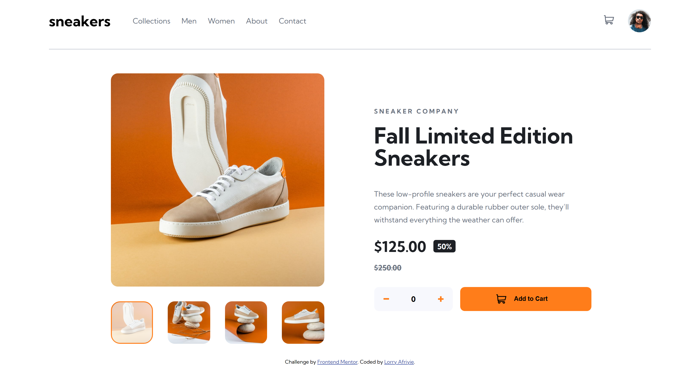
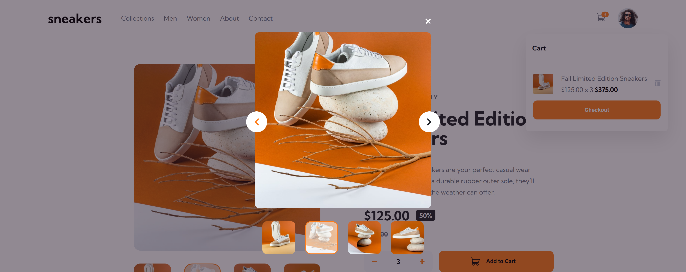
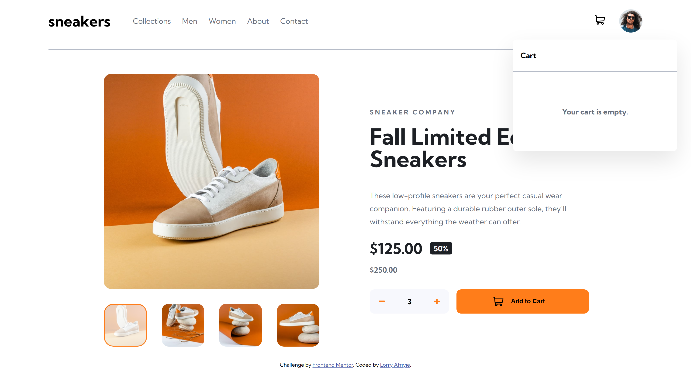
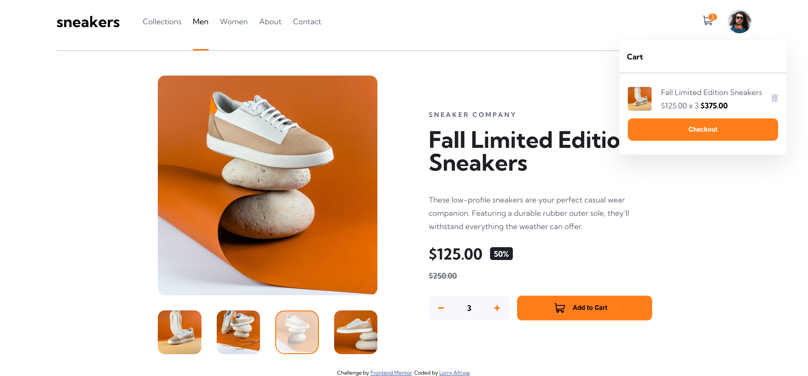
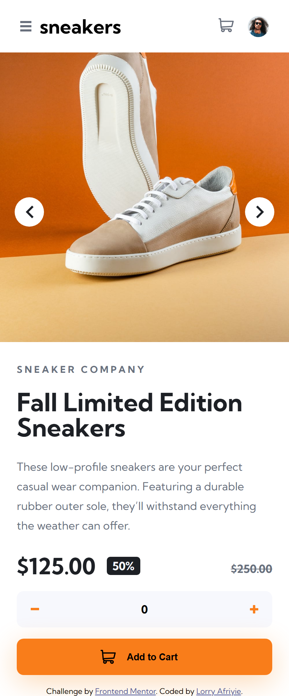
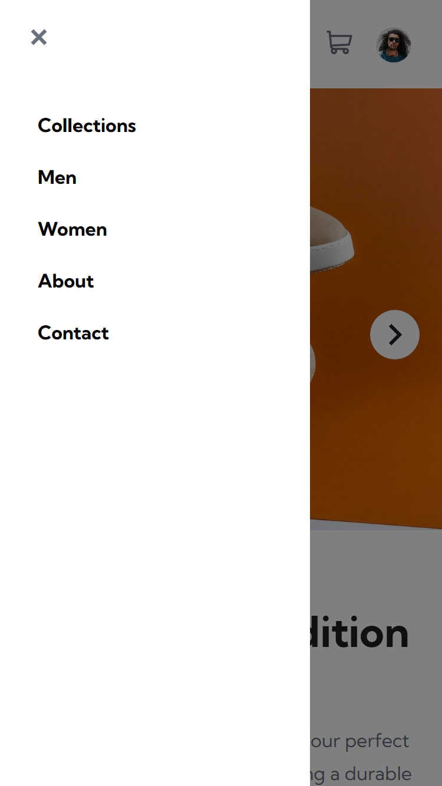
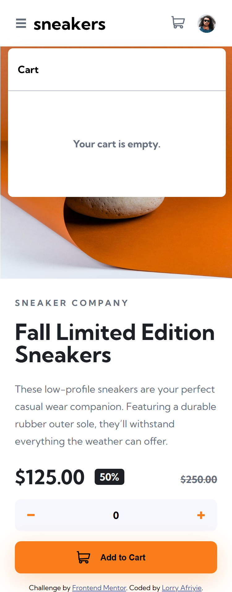
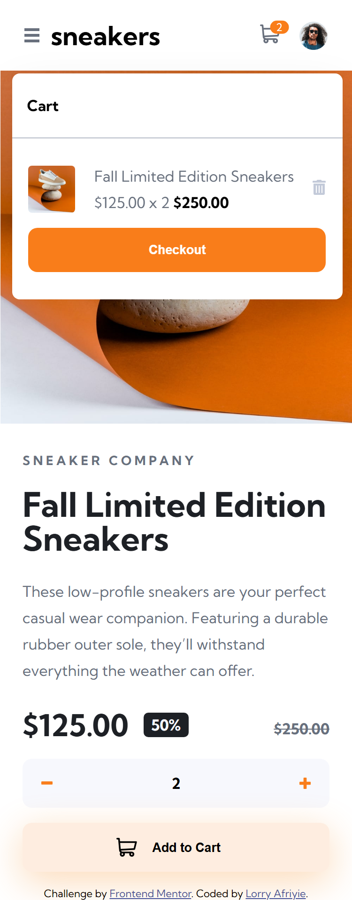

# Frontend Mentor - E-commerce product page solution

This is a solution to
the [E-commerce product page challenge on Frontend Mentor](https://www.frontendmentor.io/challenges/ecommerce-product-page-UPsZ9MJp6).
Frontend Mentor challenges help you improve your coding skills by building realistic projects.

## Table of contents

- [Overview](#overview)
    - [The challenge](#the-challenge)
    - [Screenshot](#screenshot)
    - [Links](#links)
- [My process](#my-process)
    - [Built with](#built-with)
    - [What I learned](#what-i-learned)
- [Author](#author)
- [Acknowledgments](#acknowledgments)

**Note: Delete this note and update the table of contents based on what sections you keep.**

## Overview

### The challenge

Users should be able to:

- View the optimal layout for the site depending on their device's screen size
- See hover states for all interactive elements on the page
- Open a lightbox gallery by clicking on the large product image
- Switch the large product image by clicking on the small thumbnail images
- Add items to the cart
- View the cart and remove items from it

### Screenshot

Below are screenshots of the desktop version:









Below are screenshots of the mobile version:









### Links

- Solution URL: [Project Solution URL](https://github.com/LorryAfriyie/ecommerce-product-page)
- Live Site URL: [Live Site URL](https://lorryafriyie.github.io/ecommerce-product-page)

## My process

### Built with

- Semantic HTML5 markup
- Flexbox
- CSS Grid
- SCSS
- Mobile-first workflow
- TypeScript
- [React](https://reactjs.org/) - JS library
- [Vite.js](https://vitejs.dev/) - Frontend Tooling

### What I learned

- Utilizing the tab index attribute to allow a div to be focused on

```html

<div tabindex="0">
    Lorem ipsum dolor sit amet, consectetur adipisicing elit. Alias asperiores cupiditate dolor dolorum
    ea, et ex itaque laborum maxime non officiis pariatur perspiciatis praesentium tempora voluptate? Esse fugiat modi
    tempore?
</div>
```

- Using pseudo selector to be able to create unique navbar link hover styles

```css
 a::before {
    content: '';
    height: 4px;
    width: 100%;
    background-color: var(--clr-orange);
    position: absolute;
    opacity: 0;
    inset: 56px 0 0 0;
    transition: all .2s;
    pointer-events: none;
}

a:hover::before {
    opacity: 1;
}
```

- Using scrollbar-width property to remove overflow-y: scroll scrollbar

```css
.example {
    scrollbar-width: none;
}

```

## Author

- Frontend Mentor - [@LorryAfriyie](https://www.frontendmentor.io/profile/LorryAfriyie)

